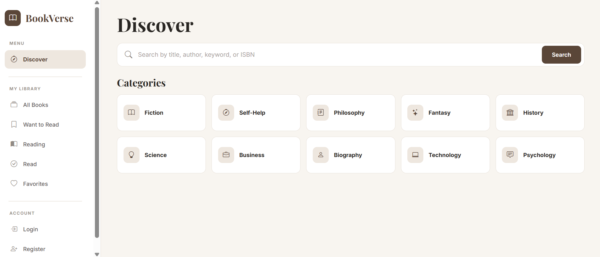
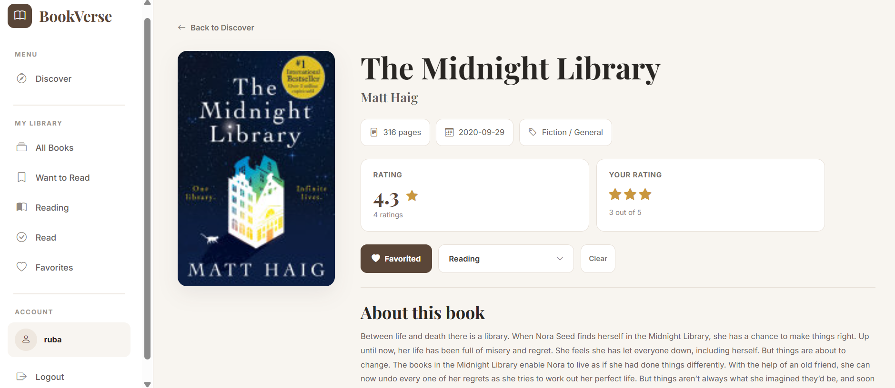
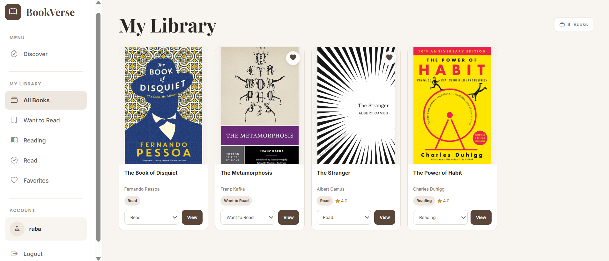

# BookVerse

BookVerse is a book discovery and reading tracker built with Java and Spring Boot.

Users can search for books, save favorites, track their reading progress, and add ratings and reviews.

## Features

- Search for books using the Google Books API
- View book details
- Register and log in
- Save favorite books
- Track books as Want to Read, Reading, or Read
- Manage a personal library
- Add, edit, and delete ratings and reviews
- REST API with Swagger documentation

## Tech Stack

- Java 26
- Spring Boot 4.0.6
- Spring MVC
- Spring Data JPA / Hibernate
- MySQL
- Thymeleaf
- HTML, CSS, Bootstrap
- Google Books API
- Swagger / OpenAPI
- JUnit, MockMvc, Mockito
- Maven

## How It Works

BookVerse uses a layered structure where controllers handle requests, services contain the application logic, and repositories manage database operations using Spring Data JPA.

Book information is retrieved from the Google Books API, while user accounts, saved books, reading progress, ratings, and reviews are stored in MySQL.

## Screenshots

### Discover

### Book Details

### My Library

